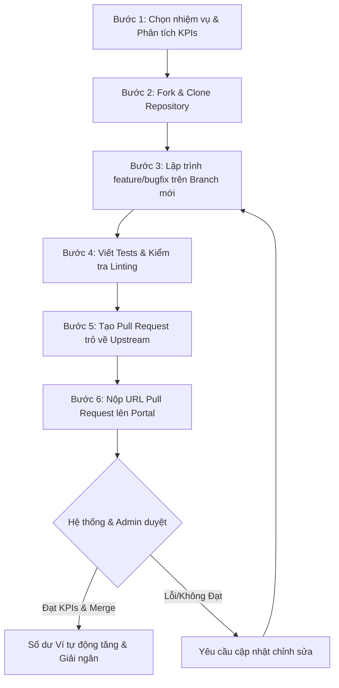

# 📋 HƯỚNG DẪN LẬP TRÌNH CHI TIẾT DÀNH CHO CỘNG TÁC VIÊN MỚI (COLLEAGUE GUIDE)

Chào mừng bạn đến với cộng đồng lập trình viên **CollabTask**! Đây là nền tảng quản trị và cộng tác công việc lập trình chuyên nghiệp, kết nối nhà phát triển với các dự án thực tế thông qua quy trình theo dõi Git tự động. 

Để đảm bảo hiệu quả làm việc cao nhất, tránh các lỗi kỹ thuật và đẩy nhanh quy trình duyệt báo cáo thanh toán, vui lòng nghiên cứu kỹ hướng dẫn từng bước và bộ tiêu chuẩn kỹ thuật dưới đây.

---

## 1. Thiết lập Môi trường Phát triển (Local Setup)

Để chạy dự án local ổn định, hệ thống khuyến nghị cấu hình phần mềm sau:
- **Node.js**: Phiên bản LTS từ `v18.x` trở lên (Khuyến nghị `v20.x` hoặc `v22.x`).
- **Package Manager**: `npm` đi kèm Node.js (hoặc sử dụng `pnpm` / `yarn` tùy đặc thù dự án).
- **Git**: Phiên bản mới nhất cài đặt trên hệ thống của bạn.
- **IDE**: Visual Studio Code (khuyến nghị cài đặt các extensions: *ESLint*, *Prettier*, và *Vitest/Jest Runner*).

### Biến môi trường (`.env`)
Tất cả các thông số kết nối cục bộ (cổng, API keys nháp, đường dẫn kết nối database local) phải được lưu trữ trong file `.env` tạo tại thư mục gốc của dự án. 
> [!CAUTION]
> Tuyệt đối **không được thay đổi tệp tin `.env.example` gốc** và **không được commit tệp `.env` cá nhân** của bạn lên GitHub. Tệp `.env` đã được đưa vào `.gitignore` mặc định của dự án để ngăn chặn rò rỉ mã bảo mật.

---

## 2. Quy trình Làm việc chuẩn với GitHub (Git Workflow)

Quy trình phát triển tại CollabTask được tự động hóa hoàn toàn thông qua cơ chế quét Webhook của GitHub. Mọi nhiệm vụ đều đi theo chu kỳ 5 bước bắt buộc sau:



### 🔹 Bước 1: Nghiên cứu kỹ nhiệm vụ và chỉ số KPIs
1. Truy cập mục **Nhiệm vụ làm việc** trên Portal CTV CollabTask.
2. Lựa chọn một nhiệm vụ phù hợp với ngôn ngữ và công nghệ của bạn (React, NodeJS, Python,...).
3. Đọc kỹ **Mô tả công việc**, **Yêu cầu kỹ thuật**, **Mốc thời gian (Milestones)** và các chỉ số **KPIs chất lượng**.

### 🔹 Bước 2: Fork và Clone Repository dự án
1. Click vào đường dẫn GitHub của Repository dự án được đính kèm trong chi tiết nhiệm vụ.
2. Nhấn nút **Fork** ở góc trên bên phải giao diện GitHub để sao chép dự án về tài khoản cá nhân của bạn.
3. Mở Terminal trên máy tính và tiến hành clone dự án đã fork:
   ```bash
   git clone https://github.com/ten-tai-khoan-cua-ban/ten-du-an.git
   cd ten-du-an
   ```
4. Cấu hình liên kết với repository gốc (Upstream) để dễ dàng cập nhật code mới nhất khi cần thiết:
   ```bash
   git remote add upstream https://github.com/original-organization/ten-du-an.git
   ```

### 🔹 Bước 3: Tạo Nhánh Phát triển (Branching)
Không bao giờ được lập trình trực tiếp trên nhánh `main` hay `master`. Bạn phải tạo một nhánh mới phục vụ cho nhiệm vụ đó. Tên nhánh phải tuân thủ nghiêm ngặt định dạng sau:
- **Tính năng mới**: `feature/task-[ID]-[ten-tinh-nang]`
  *(Ví dụ: `git checkout -b feature/task-102-auth-jwt`)*
- **Sửa lỗi**: `bugfix/task-[ID]-[ten-loi-hoac-giao-dien]`
  *(Ví dụ: `git checkout -b bugfix/task-205-login-failed`)*

### 🔹 Bước 4: Quy chuẩn Commit (Conventional Commits)
Thông điệp commit (commit messages) phải rõ ràng, ngắn gọn và tuân thủ chuẩn **Conventional Commits** quốc tế để thuận tiện cho việc tạo log tự động.
Cú pháp cơ bản: `<type>(<scope>): <subject>`

Các kiểu `type` được chấp nhận:
- `feat`: Thêm một tính năng mới.
- `fix`: Sửa một lỗi kỹ thuật.
- `docs`: Thay đổi hoặc bổ sung tài liệu.
- `style`: Định dạng code (khoảng trắng, dấu chấm phẩy, không ảnh hưởng logic).
- `refactor`: Tái cấu trúc mã nguồn (không sửa lỗi cũng không thêm tính năng).
- `test`: Thêm kiểm thử tự động hoặc sửa đổi bộ test hiện có.
- `chore`: Các cập nhật lặt vặt liên quan đến build tool, thư viện dependency.

*Ví dụ commit đúng chuẩn:*
```bash
git commit -m "feat(auth): add JWT expiration verification and refresh token API"
git commit -m "fix(ui): adjust dashboard layout alignment for mobile screens"
```

### 🔹 Bước 5: Tạo Pull Request (PR) & Nộp báo cáo
1. Đẩy nhánh code đã hoàn thành lên GitHub cá nhân của bạn:
   ```bash
   git push origin feature/task-102-auth-jwt
   ```
2. Trên GitHub cá nhân, nhấn **Compare & Pull Request**.
3. Tạo Pull Request hướng từ nhánh của bạn trỏ thẳng về nhánh `main` của **Repository gốc**.
4. Viết mô tả PR đầy đủ:
   - Các file đã chỉnh sửa/tạo mới.
   - Giải pháp kỹ thuật được áp dụng.
   - Kết quả chạy kiểm thử (kèm ảnh chụp screenshot log kiểm thử chạy local thành công nếu có).
5. Copy đường dẫn Pull Request đầy đủ dạng: `https://github.com/owner/repo/pull/[SO_PR]`.
6. Quay lại CollabTask Portal -> Chọn nhiệm vụ của bạn -> Nhấn **Nộp báo cáo**.
7. Dán link PR vào ô **Đường dẫn bằng chứng (URL)**, ghi chú thông tin và nhấn **Gửi**.

---

## 3. Quy chuẩn Viết Code & Kiểm thử (Clean Code & Testing)

### 📌 Cú pháp và Định dạng (Linting & Formatting)
- Code viết ra phải vượt qua 100% các quy tắc kiểm tra tĩnh của **ESLint** và **Prettier** trong dự án.
- Không để thừa các hàm gỡ lỗi `console.log` bừa bãi trong môi trường production.
- Đặt tên biến, hàm rõ ràng, gợi nhớ bằng Tiếng Anh. Tránh đặt các tên chung chung như `data`, `temp`, `a`, `b`.

### 📌 Độ bao phủ Kiểm thử (Unit Testing KPIs)
- Mọi API mới hoặc các React component phức tạp được bổ sung bắt buộc phải viết kèm các ca kiểm thử tự động (Unit Tests) bằng **Vitest** / **Jest** / **Cypress** tùy cấu hình dự án.
- **Chỉ số bắt buộc**: Độ bao phủ dòng lệnh (Statement Coverage) của phần code viết mới phải đạt tối thiểu từ **80%** trở lên.
- *Ví dụ về một File Test chuẩn (React Component/Function Test):*
  ```javascript
  import { describe, it, expect } from 'vitest';
  import { formatCurrency } from '../utils/formatter';

  describe('formatCurrency() Helper', () => {
    it('should format numbers correctly to VND', () => {
      expect(formatCurrency(100000)).toBe('100,000 đ');
      expect(formatCurrency(0)).toBe('0 đ');
    });

    it('should handle negative numbers properly', () => {
      expect(formatCurrency(-5000)).toBe('-5,000 đ');
    });
  });
  ```

---

## 4. Quy định Bảo mật và An toàn Kỹ thuật

Bảo mật là tiêu chí sống còn đối với dự án. Hệ thống tự động quét tĩnh (Static Analysis Security Testing - SAST) của CollabTask sẽ tự động từ chối bất cứ bài nộp nào vi phạm quy định an toàn:
1. **Lộ Secrets**: Tuyệt đối không được commit các dữ liệu nhạy cảm bao gồm: API keys, mật khẩu, database connection string, private key, JWT secret...
2. **Kỹ thuật chống tấn công cơ bản**: Phải lọc sạch dữ liệu đầu vào chống SQL Injection, sử dụng cơ chế bảo mật chống Cross-Site Scripting (XSS) và Cross-Site Request Forgery (CSRF).
3. **Thư viện bên thứ ba**: Chỉ cài đặt các thư viện thực sự cần thiết và có nguồn gốc rõ ràng thông qua NPM. Không sử dụng các thư viện đã bị cảnh báo lỗ hổng bảo mật nghiêm trọng.

---

## 5. Quy trình Thanh toán, Rút tiền & Ví tích hợp (Payout Flow)

Hệ thống CollabTask tích hợp cơ chế ví điện tử tự động cho phép lập trình viên nhận giải ngân ngay khi nhiệm vụ hoàn thành:

1. **Reviewer đánh giá**: Admin/Reviewer sẽ tiến hành chấm điểm code, kiểm tra KPIs tự động và thủ công trong vòng **24h - 48h làm việc**.
2. **Xét duyệt & Tự động cộng ví**: Khi bài nộp được phê duyệt (`Approved`), số dư ví của bạn trên portal sẽ lập tức tăng tương ứng với mức thưởng của nhiệm vụ đó.
3. **Quy định Rút tiền**:
   - Để thực hiện lệnh rút tiền, truy cập tab **Ví & Thanh toán** trên thanh menu bên trái.
   - Nhập thông tin tài khoản ngân hàng chính xác (Tên chủ tài khoản, Số tài khoản, Chi nhánh ngân hàng).
   - **Hạn mức tối thiểu (Min withdraw)**: `100,000 đ` cho một lần thực hiện rút tiền.
   - **Thời gian giải ngân ngân hàng**: Các giao dịch rút tiền được duyệt và chuyển khoản trực tiếp qua ngân hàng trong vòng tối đa **24 giờ làm việc** (loại trừ ngày Lễ, Tết). Mọi khoản tiền được chuyển đều tuân thủ chính sách minh bạch, rõ ràng, không phát sinh chi phí ẩn.

Chúc bạn có những trải nghiệm lập trình thú vị, nâng tầm kỹ năng công nghệ và đạt được nguồn thu nhập đột phá cùng hệ sinh thái phát triển phần mềm chuyên nghiệp **CollabTask**!
